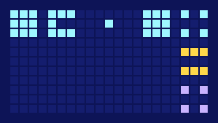

# glyph

**glyph** is the dictionary and toolkit for the *grid script*: the way humans write down what Ross 128 b sends, in InterImm's [*The Contact Era*](https://interstellar.interimm.org/).

It draws words and pages on the lattice, keeps the vocabulary honest, reads a page as a knowledge graph, and reads a drawing back into text.



*"Your world is an air-world." We answer **water** under *air*. A third party answers **air** under our *water*, siding with them.*

## Try it in one line

No install needed if you have [uv](https://docs.astral.sh/uv/):

```sh
uvx --from git+https://github.com/InterImm/glyph-cli glyph show BODY.OTHER STAR.TIME COUNT.137
```

```text
+++.+++   .+..+.+   .....+.
+++.+..   +++.+.+   ......+
+++.+++   .+..+.+   +++...+
  BODY.OTHER: your world
  STAR.TIME: pulsar
  COUNT.137: 137
```

Then follow [Getting started](getting-started.md).

## What it does

| Command | What for |
|---|---|
| `glyph parts` | The 16 parts and what they mean as a thing and as a relation |
| `glyph list`, `find`, `check` | Look words up |
| `glyph show` | Draw words |
| `glyph render` | Draw a whole page, as text or as SVG pixels |
| `glyph graph` | Read a page as a knowledge graph (text, JSON or Graphviz) |
| `glyph decode` | Read a drawing back into page source |
| `glyph init`, `add`, `remove`, `validate` | Grow the vocabulary without breaking it |
| `glyph export-md` | Publish the vocabulary as Markdown |

Every command is in the [command reference](cli.md). The rules it follows are in [The script](script.md).

## In the story

The grid script is a human transcription, run by the translating machine. It is not a script anyone has seen them use, and nobody knows what they look like. `glyph` is that machine's lexicon, made real: a growing list of signs, each with a meaning, that every new transmission is read against.
