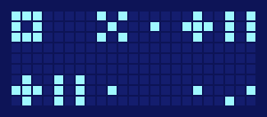
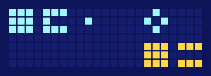
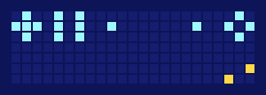
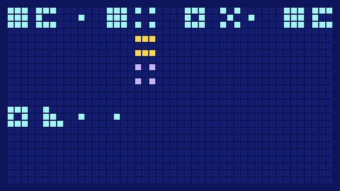

# Page files

A page is a plain text file that `glyph render`, `glyph graph` and `glyph decode` read and write.

## Format

- One **band** per line: `SYMBOL: node | relation | node`.
- The first band of a block is the **statement**, one edge of the graph. Bands under it are **other voices** replying, part by part.
- A **blank line** starts the next statement.
- `#` starts a comment.
- A word is `KIND.WHICH`, `KIND`, `_.WHICH`, or `_` for nothing. Numbers are `ONE.0` to `ONE.511` (or `_.12` in a reply).
- A symbol is any single character except a space, `.`, `#`, `|`, `:` and `_`. By convention `+` is Ross 128 b and `×` is Earth.

```text
+: BODY.OTHER | ONE | BODY.AIR     # their statement: your world is an air-world
×: _ | _ | _.WATER                 # our reply: water instead of air
```

Every line of a page is drawn with as many bands as the page has voices, so all lines are the same height. To leave room for an answer, add a band with nothing in it, such as `×: _ | _ | _`.

## Examples

These are the examples from the grammar. Their sources are in [`examples/`](https://github.com/InterImm/glyph-cli/tree/main/examples).

### “We saw your world.”

=== "Pixels"

    

=== "Text"

    ```text
    --8<-- "docs/assets/examples/saw-your-world.drawing.txt"
    ```

=== "Source"

    ```text
    --8<-- "examples/saw-your-world.txt"
    ```

```sh
glyph graph examples/saw-your-world.txt
```

### “We no longer see you.”

The shadow transmission. Change over time is two edges: we saw you; we do not see you.

=== "Pixels"

    

=== "Text"

    ```text
    --8<-- "docs/assets/examples/shadow.drawing.txt"
    ```

=== "Source"

    ```text
    --8<-- "examples/shadow.txt"
    ```

```sh
glyph graph examples/shadow.txt
```

### “Your world is water. We saw that.”

A lone `ONE` in a node slot is *that*, the line above.

=== "Pixels"

    

=== "Text"

    ```text
    --8<-- "docs/assets/examples/saw-that.drawing.txt"
    ```

=== "Source"

    ```text
    --8<-- "examples/saw-that.txt"
    ```

```sh
glyph graph examples/saw-that.txt
```

### “We see pulsars. The pulsars are twelve.”

*Pulsar* on two lines is one node with two edges.

=== "Pixels"

    

=== "Text"

    ```text
    --8<-- "docs/assets/examples/pulsars.drawing.txt"
    ```

=== "Source"

    ```text
    --8<-- "examples/pulsars.txt"
    ```

```sh
glyph graph examples/pulsars.txt
```

### “Your world is what?”

We answer *water-world* under `OPEN`.

=== "Pixels"

    

=== "Text"

    ```text
    --8<-- "docs/assets/examples/question.drawing.txt"
    ```

=== "Source"

    ```text
    --8<-- "examples/question.txt"
    ```

```sh
glyph graph examples/question.txt
```

### “How many pulsars?”

We answer 12.

=== "Pixels"

    

=== "Text"

    ```text
    --8<-- "docs/assets/examples/how-many.drawing.txt"
    ```

=== "Source"

    ```text
    --8<-- "examples/how-many.txt"
    ```

```sh
glyph graph examples/how-many.txt
```

### A third voice

It answers our *water* with *air*: it sides with them, against us, about our own world.

=== "Pixels"

    

=== "Text"

    ```text
    --8<-- "docs/assets/examples/third-voice.drawing.txt"
    ```

=== "Source"

    ```text
    --8<-- "examples/third-voice.txt"
    ```

```sh
glyph graph examples/third-voice.txt
```

### A short conversation

Three edges; the last points back at the second.

=== "Pixels"

    

=== "Text"

    ```text
    --8<-- "docs/assets/examples/conversation.drawing.txt"
    ```

=== "Source"

    ```text
    --8<-- "examples/conversation.txt"
    ```

```sh
glyph graph examples/conversation.txt
```
